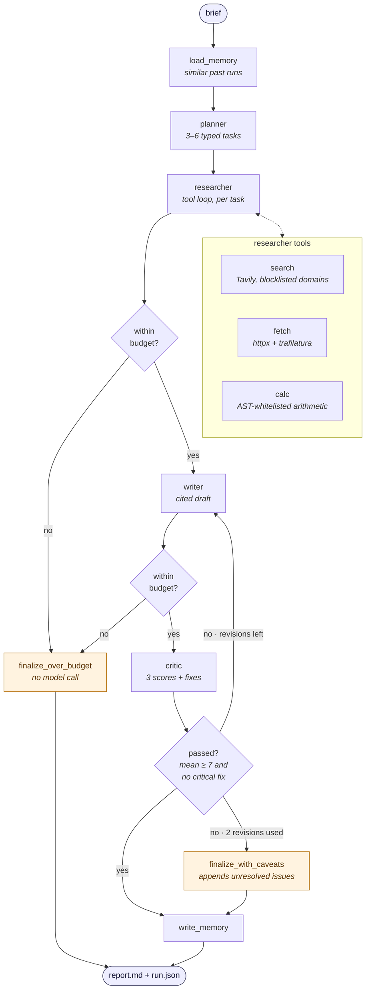
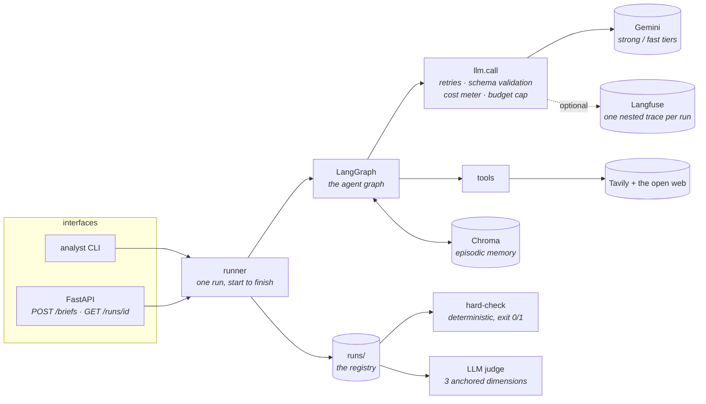

# agentic-analyst

A multi-agent research system that turns a one-line business brief into a
cited, reviewed report — with a cost ceiling it cannot exceed, a trace of every
model call, and two independent graders that say whether the output was any
good.

```bash
uv run analyst run "Assess energy options for an office building"
# runs/20260726T165538Z/report.md   ·   $0.0871   ·   37 model calls   ·   passed review
```

> **Status — Phase 4b of 7.** The pipeline, both interfaces, tracing and the
> full evaluation harness are in place. Remaining phases cover parallel
> research, a persistent run store, and deployment.

---

## Contents

- [What it does](#what-it-does)
- [Architecture](#architecture)
- [Quickstart](#quickstart)
- [Interfaces](#interfaces)
- [Evaluation](#evaluation)
- [Design decisions](#design-decisions)
- [Repository layout](#repository-layout)
- [Development](#development)
- [Known limitations](#known-limitations)

---

## What it does

Given a brief such as *"Assess energy efficiency options for a 1990s UK office
building and recommend where to spend a £500,000 retrofit budget"*, the system:

1. **Recalls** what earlier runs on similar briefs learned.
2. **Plans** the work as three to six typed research tasks.
3. **Researches** each task with web search, page fetching and arithmetic,
   recording every claim with a verbatim supporting quote and a source URL.
4. **Writes** a report in which each claim carries a `[F<id>]` citation back to
   the evidence that supports it.
5. **Reviews** the draft against a scored rubric and sends it back for revision
   if it fails.
6. **Remembers** the run — successful or not — for the next one.

A run takes two to four minutes and costs roughly $0.09. The report, the plan,
the findings and the critique are all written to `runs/<timestamp>/`.

---

## Architecture

### The agent graph

LangGraph threads one typed `AgentState` through every node. Solid edges are
unconditional; diamonds are routers that read state and choose the next hop.



Every trip round the writer ⇄ critic loop passes through the writer, which is
the only node that increments `revision_count`, so the loop is guaranteed to
terminate. Both completed paths write memory; the over-budget path goes
straight to the end, because writing memory would itself cost a model call.

### The system around it



`settings.py` is the only module that reads the environment, and `llm.py` the
only one that talks to a model provider. Agents ask for a capability tier —
`call(tier="fast", ...)` — never a model ID, so changing provider is an edit to
one dictionary.

---

## Quickstart

Requires Python 3.13 and [uv](https://docs.astral.sh/uv/).

```bash
uv sync --dev                          # install
cp .env.example .env                   # then add your Gemini and Tavily keys
uv run analyst run "Assess energy options for an office building"
```

The report lands in `runs/<timestamp>/report.md` and the run's total cost is
printed at the end.

**No API key?** Everything except a live run still works. A fresh clone with an
empty `.env` imports, lints, type-checks and passes the full mocked test suite:

```bash
uv run ruff check . && uv run mypy src tests evals scripts && uv run pytest
```

---

## Interfaces

### CLI

```bash
uv run analyst run "<brief>"      # execute a run
uv run analyst runs               # list what has been run
uv run analyst show latest -r     # inspect a past run, with its report
uv run analyst check latest       # hard-check it: citations, sources, cost
uv run analyst serve              # start the HTTP API on :8000
```

### HTTP API

A run takes two to four minutes, longer than anything between client and server
will hold a connection open, so submission and collection are separate
requests:

```bash
curl -X POST localhost:8000/briefs -H 'content-type: application/json' \
  -d '{"brief": "Assess energy options for an office building"}'
# {"run_id": "20260726T165538Z", "status": "accepted", "poll": "/runs/20260726T165538Z"}

curl localhost:8000/runs/20260726T165538Z
# {"run": {"status": "running", ...}, "report": null}      ... then, once finished:
# {"run": {"status": "succeeded", "cost_usd": 0.0871, ...}, "report": "# Energy..."}
```

| Method | Path | Purpose |
| --- | --- | --- |
| `GET` | `/healthz` | Liveness |
| `POST` | `/briefs` | Submit a brief; returns a run ID immediately |
| `GET` | `/runs` | List recent run IDs |
| `GET` | `/runs/{id}` | Run record, plus the report once it exists |

`runs/` *is* the registry — there is no database, and `GET /runs/{id}` is a
directory read. That is deliberate for a demo, and named as a limitation rather
than hidden: no cross-run queries, no concurrent writers, no retention policy.

### Tracing

Optional. Add `LANGFUSE_PUBLIC_KEY` and `LANGFUSE_SECRET_KEY` to `.env` (a free
project at [cloud.langfuse.com](https://cloud.langfuse.com) is enough) and each
run prints a trace URL alongside its cost: one nested trace per run, covering
every node, every tool call and every model call with its tokens and cost.
Leave the keys out and the run behaves identically, just unobserved.

---

## Evaluation

Two graders, and they are deliberately not the same kind of thing.

```bash
uv run python scripts/hardcheck.py runs/<id>      # facts: exit 0 or 1
uv run python -m evals.run_evals --smoke          # quality: the 3 CI briefs
uv run python -m evals.run_evals                  # the full golden set
```

**The hard-check verifies claims about reality and cannot be wrong.** Every
`[F<id>]` in the report resolves to a finding that was actually gathered, every
source URL still answers, no required section is empty, and the run stayed
inside its cost cap. It is deterministic, costs nothing, and its exit code
gates CI.

**The judge scores quality and can be wrong.** Three anchored dimensions —
coverage, groundedness, actionability — one model call each, because asking for
three scores in a single response returns three numbers that move together.
Each judge sees only what its dimension needs: coverage is graded against
`must_cover` points the pipeline never sees, groundedness against the findings
using the writer's own citation numbering. The scores are reported, not merged
into a verdict, and gate nothing unless you pass `--min-pass-rate`.

The golden set is ten briefs across four domains ([evals/golden/](evals/golden/)),
each with the points a good answer cannot omit and a note on why that brief
earns its place. Results are written to `evals/results/summary.md`: the
aggregate table plus every judge justification, which is what makes the scores
spot-checkable rather than decorative.

---

## Design decisions

**Every boundary is schema-validated.** Agents exchange Pydantic models, not
free text, so a malformed hand-off fails at the boundary that produced it
rather than three nodes downstream.

**Two kinds of retry, kept apart.** A 5xx or a timeout is retried verbatim by
`tenacity`. A schema violation is *not* — the same request would fail the same
way — so the model is re-prompted once with its own broken output attached.

**Agents ask for a capability, not a model.** `call(tier="strong", ...)`
resolves through `MODEL_TIERS`, so changing provider is a two-line edit in
[settings.py](src/agentic_analyst/settings.py). The pipeline currently runs on
the fast tier throughout; the judge runs on the strong one, so the thing being
measured and the thing measuring it are not the same model.

**The critic does not decide whether it passed.** It returns three scored
dimensions and a list of fixes carrying a severity. Whether that constitutes a
pass — mean ≥ 7, no `critical` fix — is computed by the graph from those
numbers, never read off the model's own response. A model that likes its work
can score it 10/10; it cannot also vote to ship it.

**The revision loop is a loop, not a re-roll.** A failed draft goes back to the
writer *with* the previous draft and the critic's fixes attached, ordered
critical-first. `revision_count` is incremented by the writer, on the pass that
actually rewrites, so the number means revisions performed. Two is the ceiling,
after which the report ships with an appended `## Unresolved review issues`
section rather than silently or never.

**The researcher terminates, and never crashes the run.** Six tool calls, four
findings and a twelve-step ceiling per task, with the remaining budget shown to
the model on every turn. A tool that raises is caught and handed back as an
observation — a failed fetch is a fact about the world, not an exception the
graph should die on.

**The budget guard is two layers, because the honest one is ugly.** A cap check
sits inside `llm.call`, so no node can spend past it by existing — that is the
guarantee, and it raises. On its own it would mean a run dying mid-writer with
the money already spent, so the graph *also* asks whether it is over budget
before each of the two expensive hand-offs and routes to a terminal node that
finishes the report without another model call. The guarantee is the exception;
the routing is what makes hitting it survivable.

**Tracing and cost metering are not the same feature.** Langfuse reports what a
run cost after it finished; `RUN_METER` tells the running program what it has
spent so far, which is what a budget guard has to branch on. They read the same
`_cost_breakdown`, so the dashboard and the terminal cannot drift — one live
run reconciles at $0.056164 across 37 calls on both. Tracing fails soft: with
no keys `get_tracer()` returns a disabled client that discards spans, so no
call site anywhere contains `if tracing:`.

**Memory is two different things.** [memory/episodic.py](src/agentic_analyst/memory/episodic.py)
is what the agent earned — Chroma-backed summaries of its own past runs,
retrieved by similarity to the incoming brief and loaded *before* planning, so
the plan benefits too. [memory/preferences.py](src/agentic_analyst/memory/preferences.py)
is what a human told it, read from [config/prefs.yaml](config/prefs.yaml). Both
terminal paths write memory: a run that failed review is the one most worth
remembering.

The failure modes behind several of these decisions — including a quality gate
that was scoring its own homework, and a dashboard that reported a run as free
— are written up in [NOTES.md](NOTES.md).

---

## Repository layout

| Path | What lives there |
| --- | --- |
| [src/agentic_analyst/state.py](src/agentic_analyst/state.py) | The typed contracts every agent reads and writes |
| [src/agentic_analyst/llm.py](src/agentic_analyst/llm.py) | The single door to the model: retries, cost metering, structured output |
| [src/agentic_analyst/settings.py](src/agentic_analyst/settings.py) | Config, model tiers, prices, paths |
| [src/agentic_analyst/observability.py](src/agentic_analyst/observability.py) | The only module that knows Langfuse exists |
| [src/agentic_analyst/agents/](src/agentic_analyst/agents/) | One module per graph node |
| [src/agentic_analyst/tools/](src/agentic_analyst/tools/) | `search`, `fetch`, `calc` — what the researcher can do |
| [src/agentic_analyst/memory/](src/agentic_analyst/memory/) | What survives a run: episodic (earned) and preferences (told) |
| [src/agentic_analyst/graph.py](src/agentic_analyst/graph.py) | Which node runs, and in what order |
| [src/agentic_analyst/runner.py](src/agentic_analyst/runner.py) | One run start to finish, and the `runs/` registry it writes |
| [src/agentic_analyst/api.py](src/agentic_analyst/api.py) | `POST /briefs`, `GET /runs/{id}` |
| [src/agentic_analyst/cli.py](src/agentic_analyst/cli.py) | `analyst run \| show \| runs \| check \| serve` |
| [src/agentic_analyst/hardcheck.py](src/agentic_analyst/hardcheck.py) | The deterministic checks. No model involved |
| [evals/golden/](evals/golden/) | 10 briefs with the points a good answer cannot omit |
| [evals/judge.py](evals/judge.py) | LLM-as-judge: three anchored dimensions, one call each |
| [evals/rubrics/](evals/rubrics/) | The anchors each dimension is scored against |
| [prompts/](prompts/) | System prompts, one markdown file per agent |
| [config/prefs.yaml](config/prefs.yaml) | Writer tone and length, editable without touching code |
| [tests/unit/](tests/unit/) | Fast, fully mocked. Run by default |
| [tests/integration/](tests/integration/) | Hits the real API. Run with `uv run pytest -m integration` |

---

## Development

```bash
uv run ruff check . && uv run ruff format --check .   # lint and format
uv run mypy src tests evals scripts                   # strict, no untyped defs
uv run pytest                                         # unit tests, fully mocked
uv run pytest -m integration                          # hits the real APIs
```

Two GitHub Actions workflows: [ci.yml](.github/workflows/ci.yml) runs lint,
format, types and the mocked suite on every push;
[evals.yml](.github/workflows/evals.yml) runs the smoke eval set and posts the
summary table to the pull request. `pre-commit` mirrors the CI checks locally.

Configuration worth knowing about, all in [.env.example](.env.example):

| Setting | Default | Why |
| --- | --- | --- |
| `MAX_RUN_COST_USD` | `0.50` | ~3× the worst observed run. `0` disables the guard |
| `MAX_REQUESTS_PER_MINUTE` | `12` | Just under the Gemini free-tier limit of 15 |
| `LANGFUSE_*` | unset | Tracing is optional and fails soft |

---

## Known limitations

- **Research is sequential.** Tasks are independent and would fan out cleanly,
  but the cost meter is process-global and not yet concurrency-safe. The
  trade-off is recorded rather than half-built.
- **`runs/` is the only store.** No cross-run queries, no concurrent writers,
  no retention policy. A run whose process is killed stays `running` forever,
  which is at least an accurate description of what the registry knows.
- **Episodic memory uses Chroma's default embeddings.** Adequate for
  demonstrating the mechanism; a production system would swap in a stronger
  model.
- **The judge can be wrong.** Its scores are reported alongside their
  justifications for exactly that reason, and gate nothing by default.
