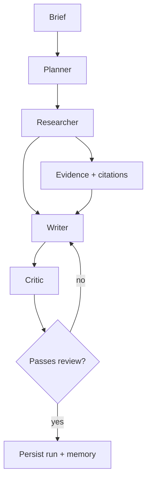

# Agentic Analyst

A multi-agent research system that turns a business brief into a grounded,
source-backed report with citations, budget controls, and review loops.

```bash
uv run analyst run "Assess energy options for an office building"
```

This project is designed to answer three questions quickly and reliably:

- What does the market say?
- What evidence supports it?
- What should a decision-maker actually do next?

It combines web research, structured reasoning, deterministic validation, and
human-readable reporting in one workflow.

---

## Why this project matters

Most AI research tools are either:

- fast but shallow, or
- detailed but not trustworthy, or
- capable of drafting, but weak at evidence discipline.

Agentic Analyst tries to close that gap.

It is built around a practical workflow:

1. turn a business brief into concrete research tasks
2. search and fetch evidence from the web
3. ground each claim in a source and citation
4. review the draft with an explicit quality rubric
5. enforce a spending ceiling during execution
6. produce a report that is auditable and reproducible

That makes it a useful example of agentic systems that are not just creative,
but operationally disciplined.

---

## What it does

Given a brief such as:

> "Assess energy efficiency options for a 1990s UK office building and recommend
> where to spend a £500,000 retrofit budget"

it will:

- recall similar prior runs
- plan 3–6 focused research tasks
- search the web and fetch source material
- extract evidence and maintain traceability
- write a cited report with structured findings
- review the draft with a rubric-based critic
- stop cleanly if the run goes over budget or fails review

A typical run takes a few minutes and costs only a fraction of a dollar.

---

## Featured demo output

The project is designed to produce a polished report that looks like the kind of
thing a consultant or analyst might hand to a client.

```md
# Energy efficiency priorities for a 1990s office building

## Executive summary

The highest-value path is to prioritise HVAC controls and commissioning,
followed by envelope improvements and lighting optimisation. These measures
reduce baseline energy demand and improve operating efficiency before more
capital-intensive upgrades are considered.

## Recommended budget split

- HVAC controls and commissioning: £150,000
- Envelope upgrades: £200,000
- Lighting and controls: £60,000
- Ventilation optimisation: £50,000
- Monitoring and contingency: £40,000
```

A full sample report is included in [demo/sample-report.md](demo/sample-report.md).

---

## Architecture overview

The system uses a typed state graph with explicit hand-offs between agents.



### Core components

- `planner`: turns the request into research tasks
- `researcher`: executes search, fetch and calculation tools
- `writer`: produces a cited report
- `critic`: grades report quality against explicit rubric dimensions
- `hardcheck`: validates citations, sources and cost constraints
- `runner`: coordinates the full run lifecycle

This creates a practical loop: research, validate, write, score, and revise.

---

## Quickstart

Requires Python 3.13 and [uv](https://docs.astral.sh/uv/).

```bash
uv sync --dev
cp .env.example .env
# add your Google and Tavily keys
uv run analyst run "Assess energy options for an office building"
```

The output lands in a timestamped run directory under `runs/`.

### Run the quality checks locally

```bash
uv run ruff check .
uv run ruff format --check .
uv run mypy src tests evals scripts
uv run pytest
```

---

## Interfaces

### CLI

```bash
uv run analyst run "<brief>"
uv run analyst runs
uv run analyst show latest -r
uv run analyst check latest
uv run analyst serve
```

### HTTP API

> Warning: this API is not safe for public deployment as-is. It exposes a job-submission endpoint with no authentication or access control, accepts arbitrary brief text, and starts external research and LLM execution that may incur real cost, access third-party systems, and expose internal credentials or data if not isolated properly.
>
> Deploy it only behind a trusted auth layer, with rate limiting, per-user quotas, network egress controls, secret management, and a sandboxed execution environment.

```bash
curl -X POST localhost:8000/briefs \
  -H 'content-type: application/json' \
  -d '{"brief": "Assess energy options for an office building"}'
```

The API accepts a brief immediately and returns a run ID to poll.

---

## Evaluation and validation

This project does not just generate prose; it checks it.

### Deterministic hard-check

The run is validated for:

- citation coverage
- source reachability
- required sections
- cost guard compliance

This is implemented in [src/agentic_analyst/hardcheck.py](src/agentic_analyst/hardcheck.py).

### LLM judge

The project also includes a separate quality grader that scores the report on
anchored dimensions such as coverage, groundedness and actionability.

```bash
uv run python scripts/hardcheck.py runs/<id>
uv run python -m evals.run_evals --smoke
uv run python -m evals.run_evals
```

This creates a practical separation between:

- factual correctness
- subjective quality assessment
- operational budget control

---

## Repository layout

| Path | Purpose |
| --- | --- |
| [src/agentic_analyst](src/agentic_analyst) | Core application code |
| [evals](evals) | Golden datasets and evaluation tooling |
| [prompts](prompts) | Agent prompts |
| [runs](runs) | Generated reports and execution metadata |
| [demo](demo) | Example report and demo assets |
| [docs](docs) | Short documentation for reviewers |
| [tests](tests) | Unit and integration tests |
| [config](config) | Project preferences and config |

---

## Project status

This project is designed as a strong technical portfolio piece in applied agentic
systems. It demonstrates:

- structured multi-agent orchestration
- evidence-backed research workflows
- deterministic validation logic
- cost-aware execution
- end-to-end report generation with review gates

The system is intentionally built to be explainable and auditable, not just
impressive-looking.

---

## Local development

```bash
uv sync --dev
uv run ruff check .
uv run ruff format --check .
uv run mypy src tests evals scripts
uv run pytest
```

This project is set up for a clean developer experience and a production-minded
review workflow.

---

## Limitations

This is a research and demo architecture, not a full production deployment stack.
It is intentionally clear about its trade-offs:

- `runs/` acts as the primary registry
- the system is single-process for the demo flow
- no durable job queue is included
- live execution still depends on external API keys and web access

These are explicit design choices rather than hidden gaps.

---

## License

This project is licensed under the MIT License. See [LICENSE](LICENSE).

## Contributing

See [CONTRIBUTING.md](CONTRIBUTING.md).

## Docs

See [docs/README.md](docs/README.md) for supporting documentation.

---

## Why it stands out

A portfolio project is strongest when it shows not just that an AI system can
write text, but that it can:

- reason across tasks
- track evidence
- control costs
- validate output
- produce something a user can trust

That is the core idea behind Agentic Analyst.

writer *with* the previous draft and the critic's fixes attached, ordered
critical-first. `revision_count` is incremented by the writer, on the pass that
actually rewrites, so the number means revisions performed. Two is the ceiling,
after which the report ships with an appended `## Unresolved review issues`
section rather than silently or never.

**The researcher terminates, and never crashes the run.** Six tool calls, four
findings and a twelve-step ceiling per task, with the remaining budget shown to
the model on every turn. A tool that raises is caught and handed back as an
observation — a failed fetch is a fact about the world, not an exception the
graph should die on.

**The budget guard is two layers, because the honest one is ugly.** A cap check
sits inside `llm.call`, so no node can spend past it by existing — that is the
guarantee, and it raises. On its own it would mean a run dying mid-writer with
the money already spent, so the graph *also* asks whether it is over budget
before each of the two expensive hand-offs and routes to a terminal node that
finishes the report without another model call. The guarantee is the exception;
the routing is what makes hitting it survivable.

**Tracing and cost metering are not the same feature.** Langfuse reports what a
run cost after it finished; `RUN_METER` tells the running program what it has
spent so far, which is what a budget guard has to branch on. They read the same
`_cost_breakdown`, so the dashboard and the terminal cannot drift — one live
run reconciles at $0.056164 across 37 calls on both. Tracing fails soft: with
no keys `get_tracer()` returns a disabled client that discards spans, so no
call site anywhere contains `if tracing:`.

**Memory is two different things.** [memory/episodic.py](src/agentic_analyst/memory/episodic.py)
is what the agent earned — Chroma-backed summaries of its own past runs,
retrieved by similarity to the incoming brief and loaded *before* planning, so
the plan benefits too. [memory/preferences.py](src/agentic_analyst/memory/preferences.py)
is what a human told it, read from [config/prefs.yaml](config/prefs.yaml). Both
terminal paths write memory: a run that failed review is the one most worth
remembering.

---

## Repository layout

| Path | What lives there |
| --- | --- |
| [src/agentic_analyst/state.py](src/agentic_analyst/state.py) | The typed contracts every agent reads and writes |
| [src/agentic_analyst/llm.py](src/agentic_analyst/llm.py) | The single door to the model: retries, cost metering, structured output |
| [src/agentic_analyst/settings.py](src/agentic_analyst/settings.py) | Config, model tiers, prices, paths |
| [src/agentic_analyst/observability.py](src/agentic_analyst/observability.py) | The only module that knows Langfuse exists |
| [src/agentic_analyst/agents/](src/agentic_analyst/agents/) | One module per graph node |
| [src/agentic_analyst/tools/](src/agentic_analyst/tools/) | `search`, `fetch`, `calc` — what the researcher can do |
| [src/agentic_analyst/memory/](src/agentic_analyst/memory/) | What survives a run: episodic (earned) and preferences (told) |
| [src/agentic_analyst/graph.py](src/agentic_analyst/graph.py) | Which node runs, and in what order |
| [src/agentic_analyst/runner.py](src/agentic_analyst/runner.py) | One run start to finish, and the `runs/` registry it writes |
| [src/agentic_analyst/api.py](src/agentic_analyst/api.py) | `POST /briefs`, `GET /runs/{id}` |
| [src/agentic_analyst/cli.py](src/agentic_analyst/cli.py) | `analyst run \| show \| runs \| check \| serve` |
| [src/agentic_analyst/hardcheck.py](src/agentic_analyst/hardcheck.py) | The deterministic checks. No model involved |
| [evals/golden/](evals/golden/) | 10 briefs with the points a good answer cannot omit |
| [evals/judge.py](evals/judge.py) | LLM-as-judge: three anchored dimensions, one call each |
| [evals/rubrics/](evals/rubrics/) | The anchors each dimension is scored against |
| [prompts/](prompts/) | System prompts, one markdown file per agent |
| [config/prefs.yaml](config/prefs.yaml) | Writer tone and length, editable without touching code |
| [tests/unit/](tests/unit/) | Fast, fully mocked. Run by default |
| [tests/integration/](tests/integration/) | Hits the real API. Run with `uv run pytest -m integration` |

---

## Development

```bash
uv run ruff check . && uv run ruff format --check .   # lint and format
uv run mypy src tests evals scripts                   # strict, no untyped defs
uv run pytest                                         # unit tests, fully mocked
uv run pytest -m integration                          # hits the real APIs
```

Two GitHub Actions workflows: [ci.yml](.github/workflows/ci.yml) runs lint,
format, types and the mocked suite on every push;
[evals.yml](.github/workflows/evals.yml) runs the smoke eval set and posts the
summary table to the pull request. `pre-commit` mirrors the CI checks locally.

Configuration worth knowing about, all in [.env.example](.env.example):

| Setting | Default | Why |
| --- | --- | --- |
| `MAX_RUN_COST_USD` | `0.50` | ~3× the worst observed run. `0` disables the guard |
| `MAX_REQUESTS_PER_MINUTE` | `12` | Just under the Gemini free-tier limit of 15 |
| `LANGFUSE_*` | unset | Tracing is optional and fails soft |

---

## Known limitations

- **Research is sequential.** Tasks are independent and would fan out cleanly,
  but the cost meter is process-global and not yet concurrency-safe. The
  trade-off is recorded rather than half-built.
- **`runs/` is the only store.** No cross-run queries, no concurrent writers,
  no retention policy. A run whose process is killed stays `running` forever,
  which is at least an accurate description of what the registry knows.
- **Episodic memory uses Chroma's default embeddings.** Adequate for
  demonstrating the mechanism; a production system would swap in a stronger
  model.
- **The judge can be wrong.** Its scores are reported alongside their
  justifications for exactly that reason, and gate nothing by default.
